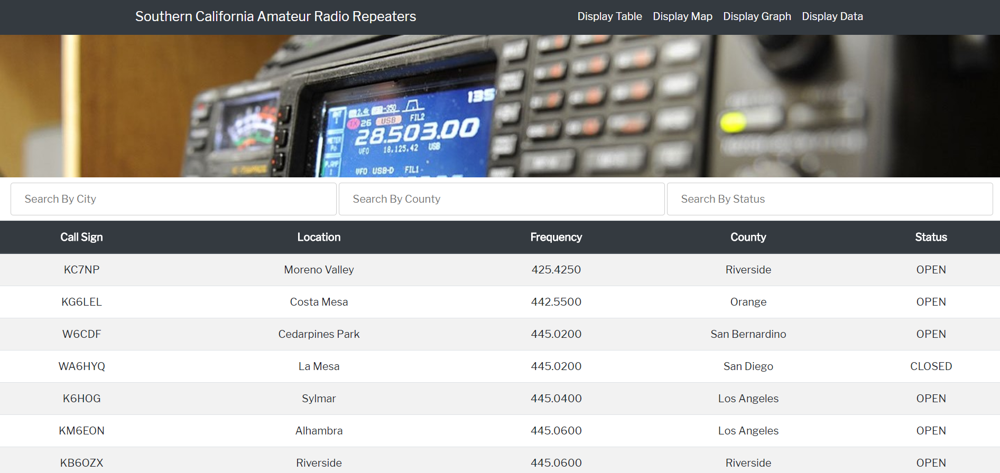

# Repeater-Scraper

Repeater Scraper is an application that scrapes data from the web site, Repeaterbook.com, which is used to build data visualizations for the information collected.  

Repeaterbook.com is a website that contains detailed information on amateur radio repeaters (transmitters) all over the United States which are used by amateur radio licensees ("ham radio") to send and receive transmissions over considerably longer distances than they'd normally be able to otherwise. 

### Data Scraping & Storage

For this project, we opted to scrape data from the site specifically for six counties in Southern California.  The data collected was originally collected using the BeautifulSoup library within Python via Jupyter and is subsequently stored via MongoDB.  

The Repeaterbook site did not have easily scraped coordinate data for each location available so we utilized the Geocoder library for Python to collect that information while joining it with the previously scraped data to store in our database.  The coordinates are approximate and based on the city each repeater is located in.

### Visualizations & Site Layout

Flask was used in rendering the HTML pages and the data visualizations were created via Javascript using Leaflet & Open Street Maps (for geo-mapping), Plotly (graph page), and Bootstrap (table page).  The "display data" link in the navbar of this app simply displays the scraped data from our MongoDB table as a JSON file.

### Languages & Libraries Used:

* Python (Geocoder, BeautifulSoup)
* Javascript (LeafletJS, PlotlyJS, D3)
* Flask
* MongoDB (PyMongo)
* Bootstrap

Designed & developed by:

Aaron Windmiller, Alvin Kim, and Marcus McBride

UCI Data Analytics Bootcamp, 2019.

